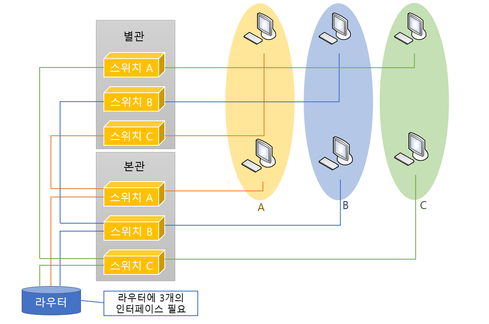
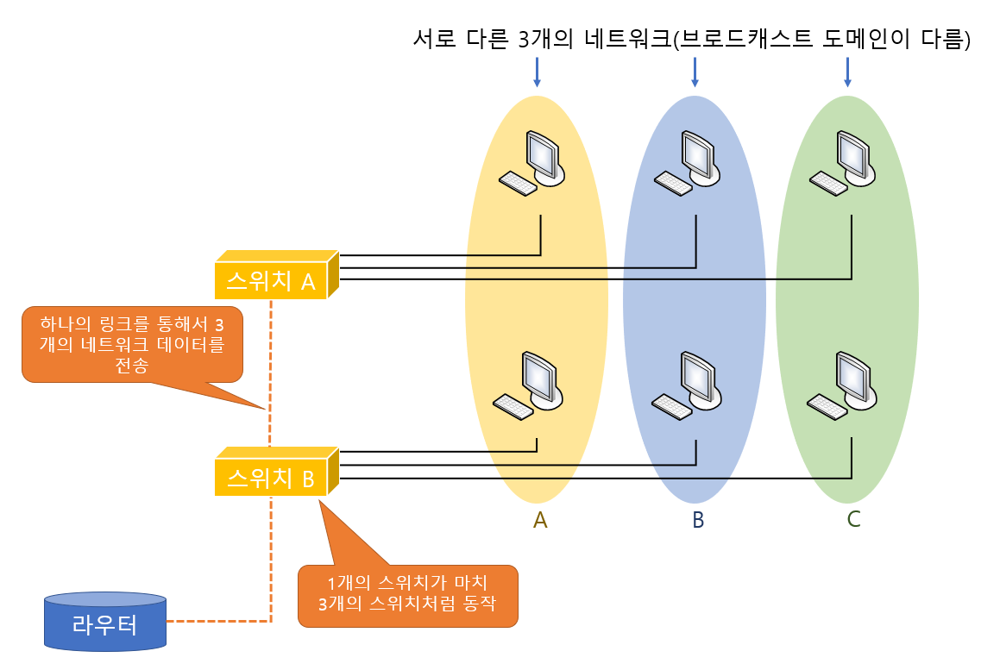

# Virtual LAN

> 하나의 스위치에서 네트워크를 분리시켜주는 가상 랜에 대하여 알아본다.

 

### VLAN의 개념

예전에는 스위치가 단순히 콜리전 영역을 나눠주는 정도의 역할만 하면 충분했었다. 그러나 브로드캐스트의 영역이 점차 커지면서 라우터에 의한 네트워크 영역의 분리는 필수가 되었고, 이런 네트워크 영역의 구분은 스위치의 능력을 뛰어넘는 기능이었다.

그런데 가상랜, 즉 VLAN 기능이 나오면서 하나의 스위치를 마치 여러 대의 분리된 스위치처럼 사용하고, 또 여러 개의 네트워크 정보를 하나의 포트로 통해 전송할 수 있게 되었다. 이러한 가상랜을 이용하면 하나의 스위치에 연결된 장비들도 브로드캐스트 도메인이 서로 다를 수 있게 된다.

위 그림의 상황에서 본과과 별관 두 개의 건물이 있고, 회사 전체는 3개의 네트워크로 나누어져 있다. 따라서 본관에 있는 라우터에서는 3개의 이더넷(Ethernet) 인터페이스가 나와야 하고, 이 3개의 인터페이스는 3개의 서로 다른 스위치에 연결되어야 한다. 만약 별관에도 똑같이 3개의 네트워크가 필요하다면 다시 3대의 스위치를 설치하고 맨 처음 스위치에서 같은 네트워크에 속한 스위치끼리 연결해 주어야 한다.

하지만 VLAN이 지원되는 라우터와 스위치를 사용하면 위 그림과 같이 라우터는 스위치로 하나의 링크만을 이용해서도 3개의 네트워크 정보를 같이 실어보낼 수가 있다. 즉, 한 선에 여러 개의 네트워크 정보를 보내는 것이 가능해 진다. 또 스위치도 여러 개의 브로드캐스트 영역을 나누어줄 수 있게 된다.

 

 

 