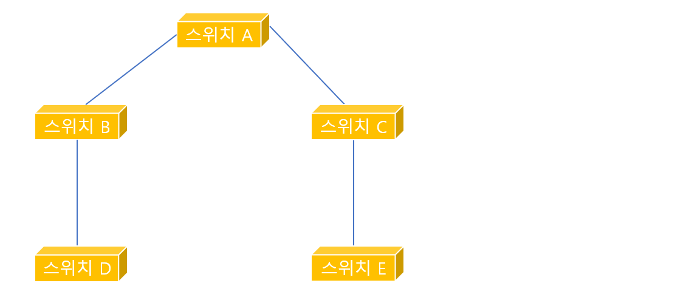
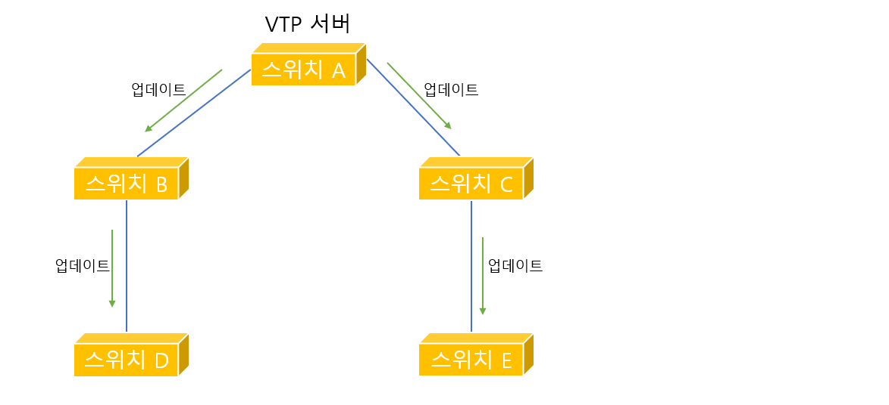
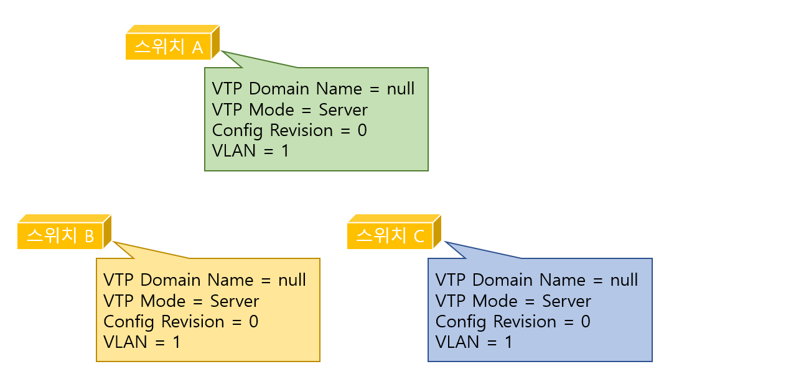
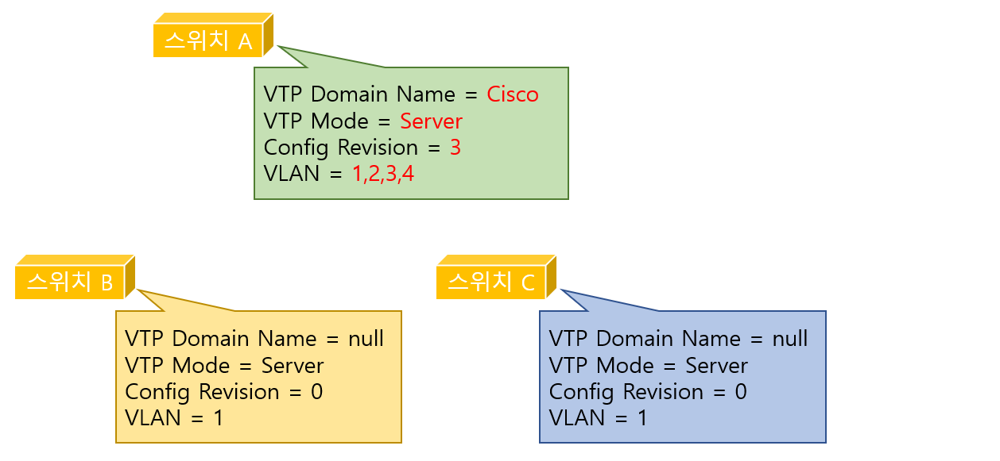
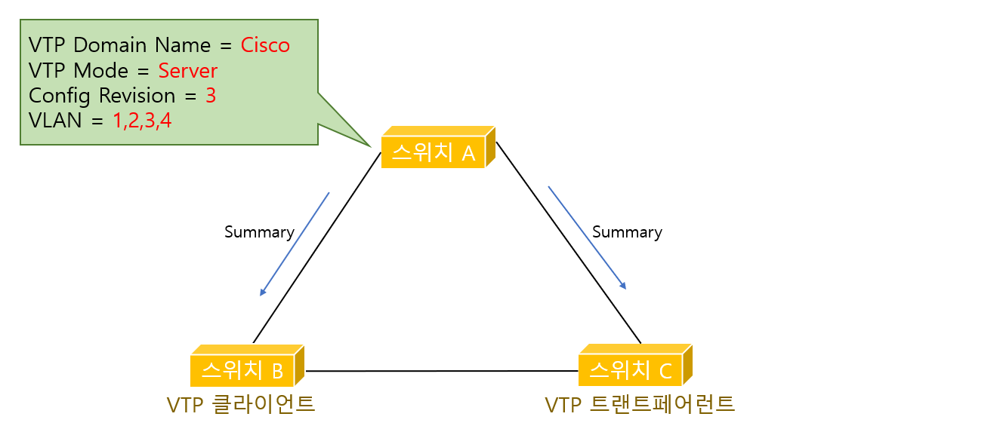
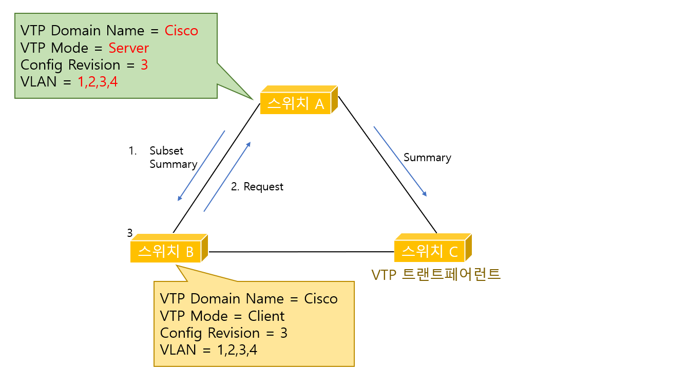

# Virtual LAN

> 하나의 스위치에서 네트워크를 분리시켜주는 가상 랜에 대하여 알아본다.

 

### VLAN의 개념

예전에는 스위치가 단순히 콜리전 영역을 나눠주는 정도의 역할만 하면 충분했었다. 그러나 브로드캐스트의 영역이 점차 커지면서 라우터에 의한 네트워크 영역의 분리는 필수가 되었고, 이런 네트워크 영역의 구분은 스위치의 능력을 뛰어넘는 기능이었다.

그런데 가상랜, 즉 VLAN 기능이 나오면서 하나의 스위치를 마치 여러 대의 분리된 스위치처럼 사용하고, 또 여러 개의 네트워크 정보를 하나의 포트로 통해 전송할 수 있게 되었다. 이러한 가상랜을 이용하면 하나의 스위치에 연결된 장비들도 브로드캐스트 도메인이 서로 다를 수 있게 된다.

위 그림의 상황에서 본과과 별관 두 개의 건물이 있고, 회사 전체는 3개의 네트워크로 나누어져 있다. 따라서 본관에 있는 라우터에서는 3개의 이더넷(Ethernet) 인터페이스가 나와야 하고, 이 3개의 인터페이스는 3개의 서로 다른 스위치에 연결되어야 한다. 만약 별관에도 똑같이 3개의 네트워크가 필요하다면 다시 3대의 스위치를 설치하고 맨 처음 스위치에서 같은 네트워크에 속한 스위치끼리 연결해 주어야 한다.

하지만 VLAN이 지원되는 라우터와 스위치를 사용하면 위 그림과 같이 라우터는 스위치로 하나의 링크만을 이용해서도 3개의 네트워크 정보를 같이 실어보낼 수가 있다. 즉, 한 선에 여러 개의 네트워크 정보를 보내는 것이 가능해 진다. 또 스위치도 여러 개의 브로드캐스트 영역을 나누어줄 수 있게 된다.

 

 

 ### VTL(VLAN Trunking Protocol)

#### 트렁킹(Trunking)

트렁킹이란 여러 개의 VLAN 들을 함께 실어나르는 것을 말한다. 즉, 각 스위치에 여러 개의 VLAN이 있기 때문에 원래는 각 VLAN 별로 링크를 만들어주어야 하지만, 그렇게 되면 너무 많은 링크가 필요하기 때문에 마치 셔틀버스처럼 모든 VLAN이 하나의 링크를 통해 다른 스위치나 라우터로 이동하기 위해 만들어진 것이다.
각 VLAN들은 각각을 구분하기 위해 트렁킹으로 전송될때 이름표가 붙는다. 이 이름표를 어떻게 붙여주나에 따라 ISL트렁킹, IEEE802.1Q 두 가지 방식으로 나뉜다.

 

#### VTL(VLAN Trunking Protocol)

VTL은 스위치들 간에 VLAN 정보를 서로 주고받아 스위치들이 가지고 있는 VLAN 정보를 항상 일치시켜 주기 위한 프로토콜이다. 이 VTL은 시스코만의 프로토콜이다.

위 그림에 있는 스위치들은 VTP기능이 지원되지 않는 스위치라고 가정하겠다. 이 스위치들에게 새로운 VLAN 하나를 추가할 필요가 생기면 스위치 A부터 스위치 E까지 5대의 스위치에 모두 VLAN구성을 변경해 주어야 한다. 또 VLAN 하나를 지우려면 역시 각 스위치의 구성에 들어가서 VLAN을 지워야 한다는 문제가 있다.

앞에서 본 것과 똑같은 구성의 스위치이지만 VTP가 enable되도록 구성하면 VTP 서버에서 한번만 VLAN 정보를 설정하면 VTP 서버는 다른 스위치와의 트렁크 링크를 통해서 VLAN 정보를 자동으로 업데이트 한다. 따라서 나머지 모든 스위치에 일일이 VLAN 정보를 업데이트 할 필요가 없는 장점이 생긴다.

 

그럼 이제 어떻게 VTP가 전체 스위치들 간에 VLAN정보를 항상 일치시켜 주는지 알아보도록 하자.
VTP간에 주고받는 메시지는 3가지 형식이 있다.

1. **Summary Advertisement**: VTP 서버가 자기에게 연결되어 있는 스위치들에게 매 5분마다 한 번씨 전달하는 메시지로 자신이 관리하는 VTP 도메인의 구성에 대한 Revision Number를 보낸다. 스위치들은 이 Revision 넘버를 보고 자신들의 VLAN정보가 최신 버전인지 아닌지를 판단한다. Summary Advertisement는 또한 VLAN 구성에 변화가 생겼을 떄도 전달이 되는데, 이때는 5분을 기다리지 않고 즉시 전달된다.
2. **Subset Advertisement**: 이 메시지는 VLAN의 구성이 변경되었을 떄나 VTP 클라이언트로부터 Advertisement Request 메시지를 받았을때 전송된다. 실제 VLAN 정보는 바로 이 Subset Advertisement에 저장되어 있다.
3. **Advertisement Request**: 이 메시지는 클라이언트가 VTP 서버에게 Summary Advertisement와 Subset Advertisement를 요청하는 용도로 사용된다. 클라이언트는 자신의 Revision 넘버보다 더 높은 Revision 넘버를 갖은 Summary Advertisement를 전달받거나 VTP 도메인 이름이 바뀌거나, Subset Advertisement 메시지를 잃어버렸거나, 스위치가 새로 리셋되었을 경우 Advertisement Request메시지를 VTP 서버에게 보낸다.

위 그림을 보면 스위치 3대가 초기 상태에서는 VTP Name이 세팅되어 있지 않다. 또한 VTP 모드는 디폴트 값인 서버 모드로 세팅되어 있다. 현재이 VLAN 업데이트 상태를 나타내는 Revision 넘버는 아직 한 번도 VLAN 업데이트가 없었기 떄문에 0으로 되어있다. 맨 아래 VLAN 역시 디폴드 1번만 존재하고 있다. 이것이 스위치를 맨 처음 켰을때의 디폴트 구성이다.

여기서 VTP의 3 가지 모드에 대해서 알아야 한다.

1. **VTP 서버 모드**: VTP 서버 모드에서는 VLAN을 생성하고, 삭제하고, VLAN의 이름을 바꿔줄 수 있으며, VTP 도메인이 안에 있는 나머지 스위치들에게 VTP 도메인 이름과 VLAN 구성, Configuration Revision 넘버를 전달해 줄 수 있다. VTP 서버는 VTP 도메인 내의 모든 VLAN 정보를 NVRAM에서 관리하며, 스위치가 꺼졌다 다시 켜지더라도 VLAN정보를 모두 가지고 있다.
2. **VTP 클라이언트 모드**: VTP 클라이언트 모드에서는 VLAN을 만들거나 삭제하고, VLAN 이름을 바꿔주는 일이 불가능하다. VTP 클라이언트는 VTP 서버가 전달해준 VLAN정보를 받고, 또 받은 정보를 자기와 연결된 다른쪽 스위치에 전달하는 것만 가능하다. 또한 VTP 클라이언트는 이 정보를 NVRAM에 저장하지 않기 때문에 만약 스위치가 리부팅하면 모든 VLAN정보를 잃게 되어 VTP 서버로부터 다시 받아와야 한다.
3. **VTP 트랜스페어런트 모드**: VTP 트랜스페어런트 모드는 VTP 도메인 영역안에 있지만 서버로붜 메시지를 받아 자신의 VLAN을 업데이트하거나 자신의 VLAN을 업데이트한 정보를 다른 스위치들에게 전달하지 않는다.VTP 도메인 안에서는 살지만 완전히 독립된 방식이다. 따라서 직접 VLAN을 만들고, 삭제할 수 있으며, 이 정보를 자기만 알면 되기 때문에 다른 스위치들에게 알리지 않는다. 다만 VTP 트랜스페어런트 모드는 서버로부터 들어온 메시지를 자기를 통해 연결된 다른 스위치쪽으로 전달해 주거나 자기와 연결된 다른 스위치쪽에서 서버쪽으로 가는 VTP메시지를 전달해주는 역할만 한다.

위 그림처럼 스위치 구성이 변경되었다. 스위치 A는 이제 VTP 서버로서 완벽한 모습을 갖추었지만 스위치B와 스위치C는 아직 초기 디폴트 상태 그대로이다. 이제 스위치 B는 VTP 클라이언트 모드로, 스위치 C는 트랜트페어런트 모드로 만들어 스위치 A와 직접 연결한다면 어떻게 구성이 변하는지 확인하자.

Summary Advertisement를 받은 스위치 B는 먼저 자신의 VTP 도메인 이름을 Cisco로 변경한다. 그리고 Configuration Revision 넘버를 비교해 본다. 비교해보니 현재 갖고 있는 Revision 넘버(0)보다 더 높은 Revision넘버(3)가 있다는것을 확인한다. 따라서 스위치 B는 VTP 서버인 스위치 A에게 Advertisement Request를 보내 업데이트된 VLAN정보를 요청한다. 그럼 스위치 A는 다시 Summary Advertisement와 Subset Advertisement를 스위치 B에게 보내주게 된다. 이제 스위치 B는 자신의 VLAN정보에 그림처럼 변경하게 된다.

위 그림처럼 VTP 클라이언트는 VTP 서버와 항상 VLAN 정보를 일치시킨다. 그리고 VTP 트랜트페어런트 모드인 스위치는 위에서 설명한대로 같은 VTP 도메인 안에서도 독립적이므로 Summary Advertisement를 받아도 자신의 VLAN 정보를 업데이트하지 않는다. 그러나 스위치 C에 다른 스위치가 추가로 연결된다면 VTP Server에서 받은 Summary Advertisement와 Subset Advertisement를 그대로 전달해주는 역할을 하게된다.