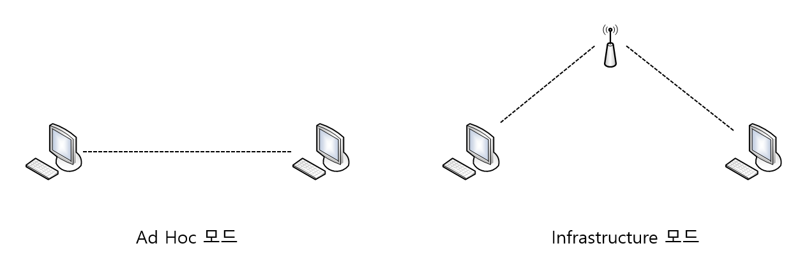
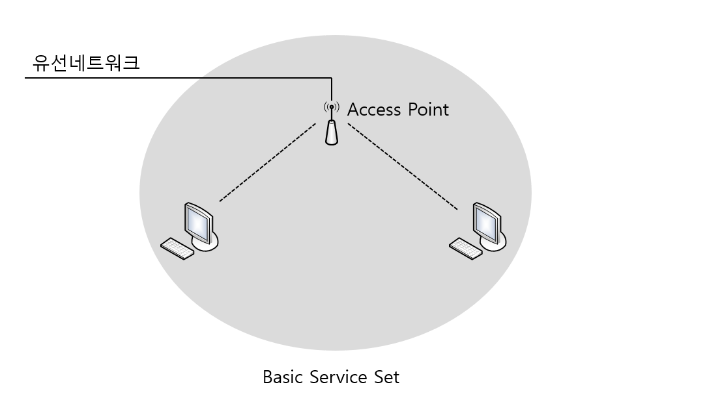
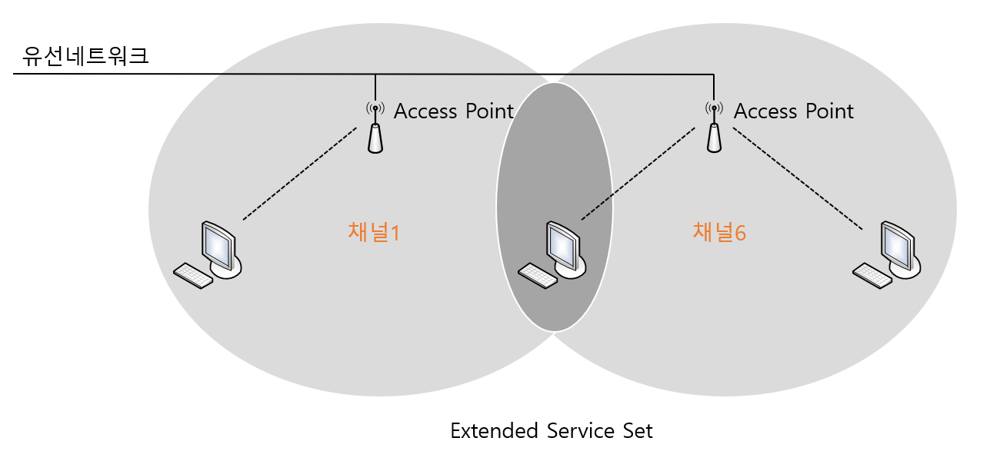

# Wireless

> 무선 통신에 대하여 알아본다.

 

### AP(Access Point)

AP는 유선과 무선을 서로 연결해주는 역할을 하는 장비이다. 한쪽은 유선 네트워크로 스위치에 붙어있고, 나머지 한쪽은 무선 랜 카드가 장착된 기기와 무선으로 통신을 한다. 

 

### CSMA/CA

무선 랜에서의 통신 방식인 IEEE802.11 즉, CSMA/CA는 Carrier Sense Multiple Access / Collision Avoidance 의 약자이다. 이더넷 방식과 비슷하지만 이더넷의 경우는 CD(Collision Delection)로 부딪히면 다시 보내는 방식인데 반해 무선은 CA(Collision Avoidance)로 충돌을 피하기 위한 대비책을 많이 가지고 있다.

CSMA/CA 통신에서 데이터를 보내는 방식은 다음과 같다.

1. **Listen Air Space(radio wave)**: 즉, 현재 통신이 일어나고 있는지 들어본다
2. **Set Random ware timer before sending frame**: 그리고 바로 데이터를 보내는 것이 아니라 다시 랜덤한 시간 동안 기다리게 된다.
3. **After timer has passed, listen again and send**: 랜덤한 시간이 흐르고 난 후 다시 한 번 더 통신이 일어나고 있는지를 들어 본 후 프레임을 전송한다.
4. **Wait for an Ack**: 하지만 무선 통신의 경우 보낸 데이터가 잘 도착했는지를 알 수 있는 방법이 없으니 보내고 나서는 항상 잘 받았다는 신호(ACK)를 기다린다.
5. **If no Ack, resend the frame(다시 1번으로)**: 만약 정해진 시간 동안에 ACK를 받지 못했다면 전송이 실패한 것으로 생각하고 1번으로 돌아가 다시 전송을 시도하게 된다.

 

### 무선 랜의 2가지 모드 

무선 랜을 구성할 때 알아두어야 할 두 가지 모드가 있는데, 하나는 **Ad Hoc** 모드이고, 또 하나는 **Infrastructure** 모드이다.

Ad Hoc 모드란 앞에서 무선 네트워킹에 꼭 필요하다는 AP를 사용하지 않고 PC에 무선 랜 카드만을 꽂아서 임시변통으로 통신하는 방식이다. 즉, PC들끼리 AP를 통하지 않고 무선으로 통신하는 것이다.

우리가 일반적으로 사용하는 무선 네트워킹의 모드는 Infrastructure 모드이다. 이 모드는 앞서 말했던 AP를 사용해서 무선 통신이 일어난다. 즉, 무선 랜 카드가 장착된 PC는 데이터를 AP에 전달하고, AP가 이 데이터를 상대방 피시에 전달해 주는 방식이다. 

Infrastructure 모드는 다시 두 가지 모드의 서비스 방식을 지원하는데 이를 Service Set이라고 부른다.

* **BSS(Basic Service Set)**
* **ESS(Extended Service Set)**

BSS는 AP 1대를 이용해서 무선 랜을 구성하는 방식을 말하고, ESS는 AP 여러 대를 이용해서 무선 랜을 구성하는 방식을 말한다. ESS와 같이 AP 여러 대를 사용해서 무선 랜을 구성하는 이유는 무선 랜을 구성하는 지역이 AP 한대로 커버되지 않는 넓은 지역이거나 접속하는 무선 장비들이 AP 한대로 커버하기에는 용량이 부족할 경우 사용하게 된다.

그림에서 ESS의 경우는 여러 개의 AP를 하나의 무선 랜에서 사용해야 하기 때문에 서로 다른 주파수를 사용하도록 구성해줘야 하는데 이를 위해 주파수간의 간섭이 발생하지 않는 영역, 즉 비중첩 채널을 사용해야만 한다. 참고로 IEEE802.11b의 경우 비중첩 채널은 3개까지 가능하고 IEEE802.11a의 경우는 시스코 AP를 사용했을 경우 국내에서 19개까지 가능하다.

 

### 무선 랜의 통신 표준

| 무선 표준   | 승인 연도 | 최대 속도 | 지원 속도                  | 사용 주파수 | 지원 채널 | 비중첩 채널 |
| ----------- | --------- | --------- | -------------------------- | ----------- | --------- | ----------- |
| IEEE802.11b | 1999      | 11Mpbs    | 1,2,5.5,11 Mbps            | 2.4GHz      | 11채널    | 3채널       |
| IEEE802.11g | 2003      | 54Mbps    | 6,9,12,18,24,36,48,54 Mbps | 2.4GHz      | 11채널    | 3채널       |
| IEEE802.11a | 1999      | 54Mbps    | 6,9,12,18,24,36,48Mbps     | 5GHz        | 23채널    | 23채널      |

 

### 무선 랜의 보안

| 무선 보안   | 키 분배 방식       | 사용자 인증 | 암호화 |
| ----------- | ------------------ | ----------- | ------ |
| WEP         | 고정형(Static)     | 없다        | 불안   |
| Cisco       | 동적 방식(Dynamic) | 802.1X      | TKIP   |
| WPA         | Static , Dynamic   | 802.1X      | TKIP   |
| 802.11/WPA2 | Static , Dynamic   | 802.1X      | TKIP   |

