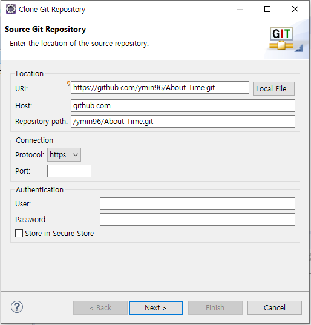
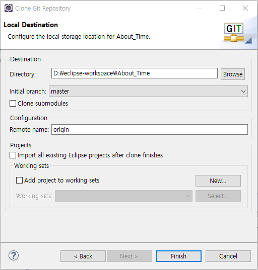
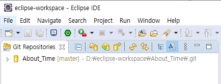
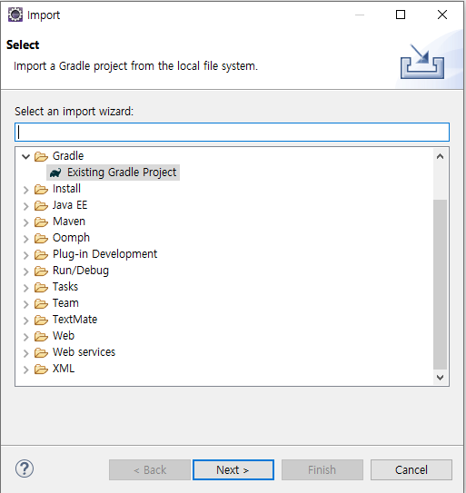
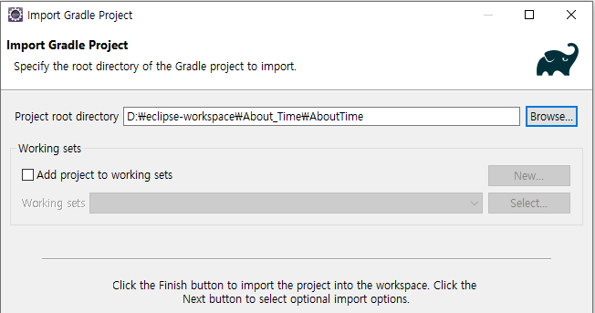
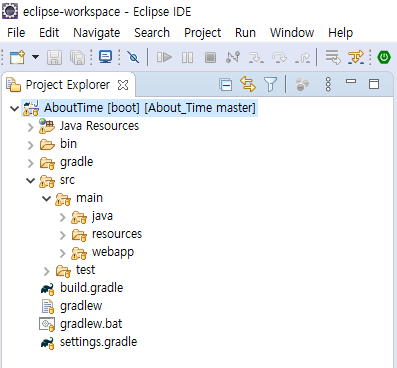

# Import spring boot gradle project

> gradle 로 만들어진 spring boot 프로젝트를 이클립스로 import 하는 방법을 설명한다. 

이클립스의 깃 페이지 창으로 들어와 사진에 빨간색으로 보이는 버튼을 눌러준다.

이 창이 나오면 URI부분에 자신이 import 하고자 하는 프로젝트의 깃헙 URI 를 복사하여 붙여넣기 해준다.

next를 누르다 이 창이 나오면 Directory 부분에 프로젝트를 저장할 Directory를 적어주면 된다.

오류가 안난다면 위 사진과 같이 clone 된 프로젝트가 표시된다.

다시 JAVA tab으로 돌아와 좌측 상단의 File - import 를 눌러 위 사진과 같이 Existing Gradle Project를 눌러준다.

next를 눌러 넘기다 해당 화면이 나오면 이전 git부분에서 프로젝트를 저장한 경로로 들어가 실제 import할 프로젝트를 선택해주면 된다.

성공한다면 이렇게 import된 gradle 프로젝트를 볼 수 있다.

~~JAVA version이 안맞아서 gradle import 가 안되는 오류로 4시간정도 삽질했다~~
